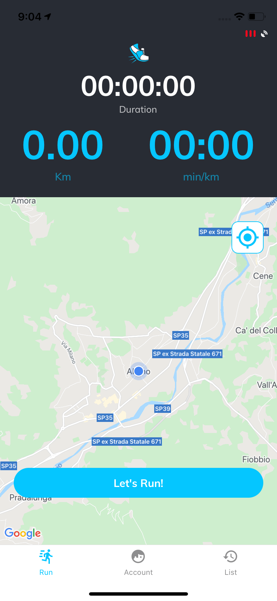

# Run Tracks
App to track runs with GPS. Built with React Native and Expo using:
- React Native Map
- Google Omniauth Login
- Firebase Cloud Storage
- Expo Background Location

|  |   |  |  |  |  |

